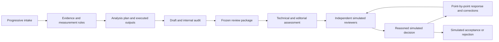

# Agentic Research Workflows

Reusable AI-assisted workflows for drafting and simulated peer review of research papers, theses, dissertations, and reports. English instructions; output in the language you choose.

Two entry points coordinate specialist roles, evidence records, reproducible analyses, and bounded revision loops. Seven upstream scientific skills are bundled at a pinned revision. No patient data, manuscript, institutional template, or personal project history is included.

**This is an instruction package, not an autonomous execution engine.** Parallel agents, model routing, tools, and slash menus depend on your host. The package does not send submissions, run paid APIs, certify research quality, or replace responsible human authors and reviewers.

## Install

Requires Python 3.10+ for the optional offline installer. The workflow instructions themselves have no Python dependency; individual bundled tools have separate requirements.

```bash
git clone https://github.com/vage88sg1/agentic-research-workflows.git
cd agentic-research-workflows
python3 scripts/install.py --dest /path/to/your/research-project/.agents/skills --dry-run
python3 scripts/install.py --dest /path/to/your/research-project/.agents/skills
```

The installer copies nine skill directories, preserves licenses and records hashes/provenance. It refuses existing destinations and does not install libraries, start services, change host settings, or make network calls. Use an absolute path if unsure about the current directory. Do not commit generated research artifacts just because the skills are installed in a repository.

For a user-level or another client's location, pass its documented skill directory to `--dest`. See [installation and host compatibility](docs/INSTALLATION.md). Installing files does not guarantee your client discovers them; refresh its skill list or start a new session.

## Use

In a Codex desktop client that exposes enabled skills in the slash menu, type `/` and select **Research drafting** or **Research review**. In Codex CLI use `/skills`. Alternatively:

```text
$research-drafting Help me draft a research paper. Ask for missing study information first. Write in English and use the balanced cost profile.
```

```text
$research-review Review manuscript.md using three independent simulated reviewers, an editor, and a bounded revision loop. Write in Spanish.
```

Resume with the same entry point and “Resume from the saved state.” Do not assume arbitrary aliases such as `/research-review` exist: select the actual menu entry your host provides.

Without native skills, give your assistant the relevant `skills/*/SKILL.md`, its references, and the applicable bundled skills; explicitly request the workflow. Report sequential role simulation honestly when independent agents are unavailable.

## Workflows



The loop ends at the configured round limit, lack of progress, a blocking information gap, acceptance, or rejection. Unresolved validity problems never turn into automatic acceptance. Optional production artifacts carry **SIMULATION — NOT SUBMITTED — NOT PUBLISHED**.

## Configure

The first intake creates a project configuration; [example settings](examples/project-config.json) show the supported concepts. Set language, document type, design, target venue, output directory, cost profile, optional budget, review count, and maximum rounds. Default: three simulated reviewers and three rounds, adaptable to scope and host capacity.

[Agent contracts and cost profiles](skills/research-drafting/references/agent-contracts.md) assign outputs, independence boundaries and escalation rules. Model names are optional examples, not dependencies or evidence of domain competence. No fixed price claims are embedded.

[Scientific integrity and skill integration](skills/research-drafting/references/skill-integration.md) explain evidence verification, scoring, tool limits, confidentiality and upstream instructions that require explicit project choices. [Synthetic evaluation](examples/SYNTHETIC_EVALUATION.md) defines behavioral checks; these have not been run as full multi-agent research trials.

## Included scientific skills

`scientific-writing`, `citation-management`, `scientific-critical-thinking`, `statistical-analysis`, `literature-review`, `scientific-visualization`, `peer-review`.

These are third-party skills from K-Dense, not OpenAI-maintained skills. Their source, license, revision, file hashes and local modifications are recorded in [THIRD_PARTY_NOTICES.md](THIRD_PARTY_NOTICES.md) and `vendor/provenance.json`. Bundled instructions and code must be inspected before use; their services and optional dependencies are not activated by this package.

## Validation and contributing

```bash
python3 -m unittest discover -s tests -v
python3 scripts/validate_package.py
```

These checks verify packaging, links, provenance, and installer behavior, not scientific correctness or successful host execution. See [contributing](CONTRIBUTING.md), [security](SECURITY.md), and the [Italian guide](docs/README.it.md).

Original workflow code and documentation: MIT. Third-party content retains its own MIT notices. See [LICENSE](LICENSE) and third-party notices. No affiliation with journals, universities, OpenAI, or K-Dense is implied.
