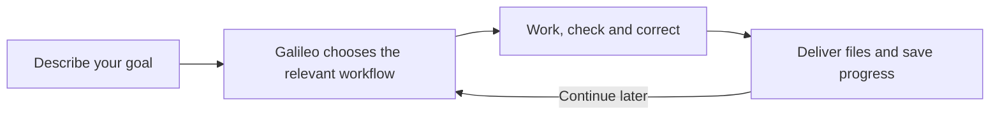

# Galileo: Agentic Research Workflows

**From research materials to manuscripts, peer-review simulations and scientific presentations—with one guided entry point.**

Galileo brings together scientific writing, specialist roles, evidence records and correction loops. Describe your goal in your preferred language; the assistant selects the relevant workflow and asks for information when it matters. Use a focused workflow or request several connected deliverables in one message.

**10 specialist workflows · 22 skill folders in the full profile · 5 offline project commands**

Works through skill-compatible AI assistants such as Claude Code, Codex, OpenCode and GitHub Copilot. The package contains portable `SKILL.md` instructions and local tools; your harness supplies models, agents and execution capabilities. Cross-client discovery support and complete runtime validation are distinct.

[Quick start](#start-here) · [Features](#features-at-a-glance) · [Workflows](#choose-your-workflow) · [Install](#install-once) · [Italian guide](docs/README.it.md)

## Features at a glance

| Capability | What Galileo provides |
|---|---|
| **Guided research assistance** | Progressive questions, narrow task routing, reusable answers and saved progress. Small edits stay small; requested multi-stage work moves between workflows. |
| **Specialist roles and correction loops** | Coordinators, writers, bibliographers, methodologists, statistical/measurement specialists and scientific/visual reviewers. Separate agents when supported and authorized; bounded revision with explicit unresolved issues. |
| **Evidence sufficiency and final-version review** | Distinguishes missing inputs from sources present but excluded; maps objectives to the author’s contribution and supporting evidence; checks section completeness, reader usability and terminology. Review records identify the delivered revision and disclose pending checks or self-review fallbacks. |
| **Scientific drafting and analysis** | Section-by-section drafting with interactive checkpoints or autonomous progression, active literature-gap searches and evidence-linked outlines/prose; design, questionnaire/scoring and missing-data checks; analysis plans, code/output records and data-faithful figures when actually executed. |
| **Realistic editorial simulation** | Technical assessment, three complementary anonymous simulated reviewers by default, reasoned editorial decisions, point-by-point author responses, corrections and rereview. |
| **Literature discovery and references** | Optional PubMed / Europe PMC, OpenAlex, Crossref and experimental Zotero integrations; query/access logs, topic and claim coverage, source-type assessment, source/claim records and citation-to-bibliography checks in both directions. Galileo proposes useful connections and can assess other MCP candidates beyond the catalog. |
| **Word and LaTeX production** | Conditional authoring routes with native document structures. Word styles/fields and supported citation managers; LaTeX automatic contents, labels/references, BibTeX or biblatex/Biber, template-compatible compilation and final PDF checks. [Office](docs/OFFICE_SUPPORT.md) · [LaTeX](docs/LATEX_SUPPORT.md). |
| **Office artifact support** | Bundled MIT Word/Excel/PowerPoint/PDF skill plus available licensed host skills; editable slide objects, template preservation, spreadsheet formulas/tables/charts and format-specific functional QA. [Details](docs/OFFICE_SUPPORT.md). |
| **Scientific slides and visual design** | Storyboards, editable PPTX/PDF or PDF-first Beamer, speaker notes and timing plans; visual directions, shared styling, representative slides and final rendered-slide review. |
| **Research-group and university branding** | Supplied or verified official logos, palettes, fonts and templates; logo placement, multiple affiliations, accessible chart colors and recorded font substitutions. |
| **Thesis conversion and oral preparation** | Focused thesis-to-article conversion with source/omission maps and word budgets; interactive defense coaching, simulated examiners and backup-slide planning. |
| **Systematic evidence synthesis** | Protocol, reproducible search, record/report/study tracking, deduplication, screening, extraction, appraisal and appropriate synthesis. Meta-analysis is conditional, not automatic. |
| **Journal dossier preparation** | Current venue requirements, cover-letter draft, title/blinded files where needed, supplements and declaration/checklist tracking. Local preparation only. |
| **Traceability and reproducibility** | Environment discovery, structural evidence audits, registered dependency/change-impact tracking, final delivery-record checks and allowlisted reproducibility bundles with hashes and recorded commands. |
| **AI provenance and document hygiene** | Executable local C2PA checks, optional official OpenAI image/audio verification, authorized mark/metadata cleanup and truthful AI-assistance declarations. Unsupported text checks stay explicit. [Scope and tools](docs/AI_PROVENANCE.md). |
| **Provider flexibility and cost guidance** | Guided installation-time alias mapping, optional role overrides, economy/balanced/quality guidance, targeted delegation and reuse of verified evidence. Actual routing and costs depend on the host. |

These are workflow instructions plus scoped local tools. File creation, computation, independent contexts, browsing and rendering are claimed only when actually performed. [Detailed workflow designs](docs/WORKFLOW_GUIDE.md) · [Validation and limits](docs/RELEASE_REVIEW.md)

## Start here

After installation, ask your assistant to use the **Galileo** skill and describe your goal. Include the location of any materials you already have:

```text
Use the Galileo skill to help me write my thesis.
I have a study description and results in study_inputs/.
Write in English and guide me through the next step.
```

No workflow names, model selection or JSON configuration are needed for normal use. Explicit invocation depends on your harness:

| Harness | Project skill directory | How to start |
|---|---|---|
| Claude Code | `.claude/skills/` | `/galileo` followed by your request |
| Codex | `.agents/skills/` | `$galileo` followed by your request, or select Galileo in the supported skill menu |
| OpenCode | `.opencode/skills/` | Ask the agent to load the Galileo skill and follow your request |
| GitHub Copilot, in a skill-capable mode | `.github/skills/` | Ask the agent to use the Galileo skill and follow your request |
| Other skill-compatible harnesses | The directory documented by the harness | Use its skill menu, invocation syntax or an explicit natural-language request |

These are documented skill discovery paths, not a claim of end-to-end testing on every harness. See the [installation and compatibility guide](docs/INSTALLATION.md) for sources and execution limits. The installer copies skills; it does not create a universal slash command.

## Choose your workflow

Start through Galileo without memorizing these names, or invoke a specialist directly using your harness's skill mechanism.

| Workflow | Use it for | Main outputs |
|---|---|---|
| [Galileo - Research drafting](docs/WORKFLOW_GUIDE.md#workflow-a--draft-a-paper-or-thesis) | A paper, thesis, dissertation or scoped text edit | Outline/draft, evidence and actual analysis records, unresolved questions |
| [Galileo - Research review](docs/WORKFLOW_GUIDE.md#workflow-b--simulate-editorial-review-and-revision) | Simulated peer review and editorial revision | Reviewer reports, decision, responses, revised manuscript and issue ledger |
| [Galileo - Research typesetting](docs/WORKFLOW_GUIDE.md#workflow-c--format-in-docx-or-latex) | Production of checked scientific text | Selected DOCX/TeX source and requested PDF when built |
| [Galileo - Research presentations](docs/WORKFLOW_GUIDE.md#workflow-d--create-scientific-presentation-slides) | Conference, seminar, journal club or defense slides | Storyboard, style and representative slides, requested deck files, notes and timing |
| [Galileo - Research project](docs/WORKFLOW_GUIDE.md#workflow-e--check-project-capabilities-evidence-and-changes) | Capability/evidence checks and reproducibility | Preflight, evidence/impact reports and selected-file bundle |
| [Galileo - Thesis to article](docs/WORKFLOW_GUIDE.md#workflow-f--convert-a-thesis-into-an-article) | Focused conversion of an existing thesis | Article draft, conversion/omission map and word budget |
| [Galileo - Research defense](docs/WORKFLOW_GUIDE.md#workflow-g--rehearse-a-defense-or-scientific-qa) | Interactive oral rehearsal | Questions, feedback, answer notes and backup-slide brief |
| [Galileo - Submission dossier](docs/WORKFLOW_GUIDE.md#workflow-h--prepare-a-submission-dossier) | Journal-specific file preparation | Cover letter, file/declaration checklist and local dossier |
| [Galileo - Systematic review](docs/WORKFLOW_GUIDE.md#workflow-i--conduct-a-systematic-review) | Explicit systematic evidence synthesis | Protocol, search/screening/extraction/appraisal records and synthesis |
| [Galileo - AI provenance](docs/WORKFLOW_GUIDE.md#workflow-j--inspect-ai-provenance-and-clean-document-artifacts) | Watermark/provenance checks, authorized cleanup and AI-use declarations | Scoped audit, actual test limits, requested derivative, change log and preservation QA |

Specialist UI labels use the `Galileo -` prefix where the host reads `agents/openai.yaml`. Skill identifiers and invocation syntax are unchanged; the main entry point remains **Galileo**.

Each workflow has its own diagram and examples in the [advanced guide](docs/WORKFLOW_GUIDE.md). You do not have to complete all ten.

Try a request such as:

```text
Turn this thesis into a focused article, run a simulated peer review,
and help me correct the manuscript. Then create a 12-minute scientific talk
using the research-group branding in brand_assets/.
```

Or start with one smaller task: “Improve this paragraph,” “Check these references,” or “Rehearse my defense one question at a time.” Galileo handles the requested handoffs without a new command at each step.

## What to expect

1. **A short conversation:** Galileo uses the material already supplied and asks only the next necessary questions.
2. **A clear next step:** it chooses the relevant specialist workflow and uses available tools.
3. **A reviewable result:** you receive files, checks linked to that revision and any unresolved issues. Essential project gaps trigger focused questions and a wait for answers; external-knowledge gaps trigger targeted source searches. Unresolved central gaps keep final readiness pending.

Small requests stay small: a language edit returns the corrected text, and a Markdown slide outline does not require export setup or new project records. Longer research projects keep resumable state.



Full manuscripts and theses default to a section-by-section plan: outline, provisional introduction/context, then the appropriate methods/implementation and results/evaluation sections. Choose interactive chapter checkpoints or autonomous progression; each section is checked and corrected before expansion. Abstract and conclusions are finalized later, followed by whole-document review.

For full projects, evidence/content review is separate from terminology and reader-focused editing and from visual production checks. Established disciplinary terms and exact technical identifiers are preserved, including customary English terms in other-language prose. Primary literature is consulted to resolve background and interpretation gaps; it cannot supply missing project facts. Unsupported central claims, invented references/results and unresolved substantive contradictions block final readiness. A successful export is not treated as proof of a complete thesis or readable presentation. [Evidence and delivery checks](skills/galileo/references/quality-gates.md)

Format choices such as Word or LaTeX are discussed when they matter. Technical evidence records, model settings and dependency checks stay in the project records and are explained when useful. The default cost guidance is balanced; actual model use depends on your host.

To resume in the same project, invoke Galileo using your harness and say:

```text
Continue from the saved state in research_workspace/. Reuse my previous answers.
```

If more than one run could match, Galileo asks which one to continue.

## Install once

Requires Python 3.10+ for the offline installer. Clone the package:

```bash
git clone https://github.com/vage88sg1/agentic-research-workflows.git
cd agentic-research-workflows
```

Then install into your research project's skill directory. Choose **one** command matching your harness and replace `/path/to/research-project` with the actual path:

```bash
# Claude Code
python3 scripts/install.py --dest "/path/to/research-project/.claude/skills"

# Codex
python3 scripts/install.py --dest "/path/to/research-project/.agents/skills"

# OpenCode
python3 scripts/install.py --dest "/path/to/research-project/.opencode/skills"

# GitHub Copilot
python3 scripts/install.py --dest "/path/to/research-project/.github/skills"
```

Then open that research project in your assistant and refresh its skills or start a new session. The default complete installation includes Galileo and its specialist/support skills. Add `--dry-run` to preview the installation. Existing skill names are never overwritten; see the [installation guide](docs/INSTALLATION.md) for updates, other clients and smaller profiles.

In an interactive terminal, installation offers guided model setup: choose your harness, map `economical`, `balanced` and `frontier` to available model IDs, select a cost profile and optionally override individual roles. You can defer, reuse one model for all aliases, or use `--non-interactive` / `--model-settings FILE` for automation. Choices are saved locally and checked against actual host capabilities during execution. [Model setup and reconfiguration](docs/MODEL_SETUP.md).

The installer copies instructions and local tools. It does not install document renderers, activate MCP services or purchase API access. The assistant reports missing capabilities when they affect your task.

## Agentic execution and portability

The workflow instructions describe coordination, specialist roles and review loops. For separate agents, include a request such as:

```text
Use Galileo in agentic mode. Delegate the relevant roles to separate agents
where supported, and coordinate their reviews and corrections.
```

Independent agents require harness support and permission to delegate. Otherwise, the assistant follows the roles sequentially and discloses that limitation. Installing skills does not install native agent definitions or guarantee parallel execution.

Model examples are optional guidance, not a dependency on one provider. Use models available in your harness; actual routing and costs depend on its capabilities. Codex UI metadata can be ignored by other clients.

## Literature connections that fit the task

Galileo proposes a useful connection when the next step needs it and equivalent tools are unavailable:

- **PubMed / Europe PMC:** biomedical and clinical literature.
- **OpenAlex:** cross-disciplinary discovery and citation neighbors.
- **Crossref:** DOI and bibliographic metadata checks.
- **Zotero, experimental:** reuse of an authorized reference library.

The catalog is open to alternatives. Galileo can research other task-relevant MCPs, assess current upstream documentation, compatibility, maintenance, permissions and costs, and present linked recommendations. Newly discovered servers remain candidates rather than tested bundled integrations. Your choice is preserved across resumptions.

Setup uses your actual harness and authorization; a recommendation does not activate a service. MCP does not grant institutional paywall access. [Integration guide and configuration examples](docs/LITERATURE_INTEGRATIONS.md)

## Project tools and installation profiles

Five offline standard-library commands ship in the research-project skill: `preflight` for environment discovery, `evidence` for structural source/claim checks, `impact` for registered dependency changes, `delivery` for final output hashes and recorded check/readiness consistency, and `bundle` for selected reproducibility files. They complement source assessment and actual analysis execution; packaging does not execute research code. [Commands and runnable synthetic example](docs/PROJECT_TOOLS.md)

The default full profile installs **Galileo, ten specialist workflows and eleven upstream support skills**. Smaller `core`, `docx`, `latex`, `slides`, `publishing`, `defense` and `systematic` profiles are available. Every profile includes Galileo, project support and AI provenance. Installation preserves licenses/provenance, checks vendor hashes and refuses existing names. [Profiles and format choices](docs/FORMATS_AND_SLIDES.md)

## Validation and execution boundaries

Package checks and synthetic workflow exercises are documented in the [release review](docs/RELEASE_REVIEW.md) and [usability report](docs/USABILITY_TESTS.md). Complete runs on Claude Code, OpenCode and GitHub Copilot have not yet been verified.

## Explore when needed

- [All ten specialist workflows, examples and diagrams](docs/WORKFLOW_GUIDE.md)
- [Word, LaTeX, PowerPoint and PDF](docs/FORMATS_AND_SLIDES.md)
- [Optional scientific literature connections](docs/LITERATURE_INTEGRATIONS.md)
- [Evidence tracking, change impact and reproducibility tools](docs/PROJECT_TOOLS.md)
- [Guida rapida in italiano](docs/README.it.md)

Galileo is an instruction package that works through your AI host. It keeps evidence and execution limits explicit; simulated peer review is labeled as such. It does not submit to journals or create real acceptance. Establish the authorized processing boundary before supplying confidential research material.

[Validation and remaining limitations](docs/RELEASE_REVIEW.md) · [Contributing](CONTRIBUTING.md) · [Security](SECURITY.md) · [Third-party notices](THIRD_PARTY_NOTICES.md) · [MIT license](LICENSE)
