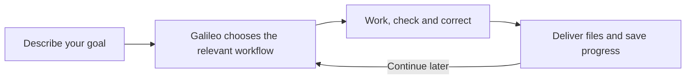

# Galileo: Agentic Research Workflows

**Describe what you want to achieve. Galileo guides the research work.**

Write a thesis or paper, improve a manuscript, prepare slides, or rehearse your defense. Start with one entry point; Galileo selects the relevant workflow and asks for missing information as it becomes necessary. Work in your preferred language.

## Start here

After installation, type `/` in a compatible Codex desktop client and select **Galileo**. Then describe your goal and provide the location of any materials you already have. In Codex CLI, use `/skills` to select it. You can also invoke it explicitly:

```text
$galileo Help me write my thesis. I have a study description and results in study_inputs/.
Write in English and guide me through the next step.
```

No workflow names, model selection or JSON configuration are needed for normal use. Menu availability depends on the client; the installer does not register a literal `/galileo` alias.

## What would you like to do?

| Start with this | Galileo helps you do |
|---|---|
| “Help me write my thesis.” | Clarify the question, organize evidence/results and develop a draft |
| “Improve this manuscript.” | Make scoped improvements; run simulated peer review when you request it |
| “Create a 12-minute talk from this paper.” | Plan and produce slides, notes and timing with scientific and visual checks |
| “Turn my thesis into an article.” | Select a focused scope and preserve a map back to the thesis |
| “Help me rehearse my defense.” | Ask questions, wait for your answers and provide feedback |
| “Prepare the files for this journal.” | Assemble a local submission dossier and identify missing declarations |
| “Help me plan a systematic review.” | Develop the protocol and documented search, screening and synthesis process |

You can request a sequence in one message, such as “Turn this thesis into an article, then create presentation slides.” Galileo handles the requested handoffs without requiring a new command at each step.

## What to expect

1. **A short conversation:** Galileo uses the material already supplied and asks only the next necessary questions.
2. **A clear next step:** it chooses the relevant specialist workflow and uses available tools.
3. **A reviewable result:** you receive files, meaningful checks and any unresolved issues.



Format choices such as Word or LaTeX are discussed when they matter. Technical evidence records, model settings and dependency checks stay in the project records and are explained when useful. The default cost guidance is balanced; actual model use depends on your host.

To resume in the same project, select Galileo again and say:

```text
Continue from the saved state in research_workspace/. Reuse my previous answers.
```

If more than one run could match, Galileo asks which one to continue.

## Install once

Requires Python 3.10+ for the offline installer. Replace the destination with the skill directory of your research project:

```bash
git clone https://github.com/vage88sg1/agentic-research-workflows.git
cd agentic-research-workflows
python3 scripts/install.py --dest /path/to/your/research-project/.agents/skills
```

Then open that research project in your assistant and refresh its skills or start a new session. The default complete installation includes Galileo and its specialist/support skills. Add `--dry-run` to preview the installation. Existing skill names are never overwritten; see the [installation guide](docs/INSTALLATION.md) for updates, other clients and smaller profiles.

The installer copies instructions and local tools. It does not install document renderers, activate MCP services or purchase API access. The assistant reports missing capabilities when they affect your task.

## Explore when needed

- [All nine specialist workflows, examples and diagrams](docs/WORKFLOW_GUIDE.md)
- [Word, LaTeX, PowerPoint and PDF](docs/FORMATS_AND_SLIDES.md)
- [Optional scientific literature connections](docs/LITERATURE_INTEGRATIONS.md)
- [Evidence tracking, change impact and reproducibility tools](docs/PROJECT_TOOLS.md)
- [Guida rapida in italiano](docs/README.it.md)

Galileo is an instruction package that works through your AI host. It keeps evidence and execution limits explicit; simulated peer review is labeled as such. It does not submit to journals or create real acceptance. Establish the authorized processing boundary before supplying confidential research material.

[Validation and remaining limitations](docs/RELEASE_REVIEW.md) · [Contributing](CONTRIBUTING.md) · [Security](SECURITY.md) · [Third-party notices](THIRD_PARTY_NOTICES.md) · [MIT license](LICENSE)
