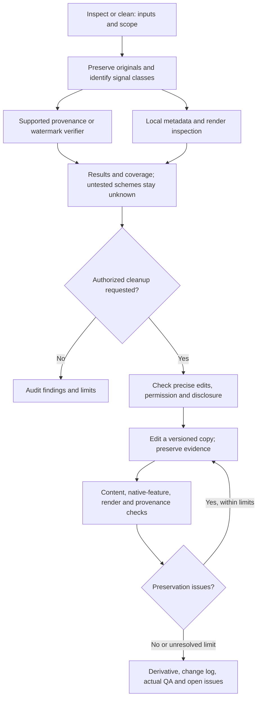

# AI provenance, watermark checks and document cleanup

Use **Galileo - AI provenance** (`research-provenance`) to inspect research documents and assets, review genuine AI-assistance declarations and clean specific authorized file artifacts. It is included in every installation profile. The workflow distinguishes visible marks, ordinary metadata, signed provenance, statistical/embedded watermarks and AI-writing classifier scores.

Start through Galileo in plain language, or invoke the specialist using your harness:

```text
Use Galileo to check this thesis and its figures for AI provenance and watermark signals.
Inspect locally, preserve the originals, and explain which checks are unavailable.
```

```text
$research-provenance Remove my self-added DRAFT watermark and author metadata
from an anonymized copy of manuscript.docx. Preserve citations, fields and layout,
then compare the copy with the original. Keep any required AI-use declaration accurate.
```

Codex uses the explicit `$` syntax or the available skill menu; other harnesses use their supported invocation mechanism. There is no universal slash alias registered by the installer.

## What the workflow does

| Requested work | Outcome |
|---|---|
| Inspect visible marks, file properties and embedded assets | Findings tied to real inspected files/pages/assets and actual tools |
| Verify Content Credentials/C2PA or a supported watermark | Scheme-specific validator results, trust/coverage limits and tests unavailable |
| Remove a user-owned draft/template mark or unwanted ordinary metadata | Versioned derivative, retained original, exact change log and preservation QA |
| Authorized provenance-bearing metadata redaction | Retained original evidence, documented derivative loss/validation status and truthful required disclosure; supported provenance-preserving export preferred |
| Check AI writing assistance and venue rules | Author-supplied usage record and accurate declaration draft; missing facts stay pending |
| Improve scientific prose | Evidence/terminology-based editing through drafting when appropriate, with preserved claims |

The workflow does not promise undetectable text, universal watermark removal or a certificate of human authorship. It does not forge credentials, erase required attribution/disclosures or optimize text to fool detectors. Statistical word-choice marks are different from file metadata and formatting characters. A negative test, missing credential or low classifier score cannot establish that no AI was used.

## Official verification routes

| Route | Integrated behavior | Scope |
|---|---|---|
| C2PA Tool + [official test assets](https://spec.c2pa.org/public-testfiles/) | Local executable adapter; raw diagnostics, credential validity and trust recorded | Supported credentials; selected fixture checks do not certify AI authorship or product conformance |
| [OpenAI Content Provenance API](https://developers.openai.com/api/docs/guides/content-provenance) | Optional media adapter with explicit upload flag and eligible account | Supported images/audio; does not check manuscript text |
| [Anthropic text-watermark verification](https://www.anthropic.com/news/claude-text-watermark) | Access check and unavailable status; no invented public adapter | Private preview; current authorized access/documentation required |

Tell Galileo: **“Check the available official provenance signals for these files, run compatible local checks, and report what remains untested.”** It selects the installed helper when appropriate. External processing requires authorization; implementation/testing uploads no private manuscripts. See [executable commands, prerequisites, results and exit codes](../skills/research-provenance/references/verification.md). A negative result or inaccessible test cannot establish that no AI was used.

## Optional tools and current limitations

The package does not automatically install or subscribe to external detectors. [C2PA Tool](https://github.com/contentauth/c2patool) is an optional supported-media inspector; actual signature/trust diagnostics are recorded. Generic document tools inspect editable properties/objects and preserve native features. Rendering, ordinary metadata inspection and C2PA verification are distinct checks.

As checked on 2026-10-04, [Anthropic describes a statistical text watermark and a private-preview detection API](https://www.anthropic.com/news/claude-text-watermark). Its mark uses word choices rather than invisible characters. [OpenAI's current provenance tool documentation covers supported image/audio signals](https://openai.com/index/advancing-content-provenance/); it does not establish a universal manuscript-text check. Provider/API access and supported formats must be verified at runtime. Sources and interpretation rules ship with the [workflow reference](../skills/research-provenance/references/inspection.md).

Optional AI-writing classifiers include [Turnitin](https://guides.turnitin.com/hc/en-us/articles/22774058814093-Using-the-AI-Writing-Report) and [Pangram](https://www.pangram.com/research/model-card/pangram-4), subject to user-requested access, language/length coverage and processing permission. They are classifier services, not general watermark validators, and are not installed, subscribed to or benchmarked by Galileo.

No external upload follows from an inspection request. Private research remains within the authorized processing boundary. For cleanup, the user identifies the mark/property and authorizes the operation; existing session authorization is reused. Unsupported watermark tests/removal methods remain explicitly unavailable. Ownership/licensing, institution/journal disclosure policy and technical capability are assessed separately.

## Workflow design



The coordinator uses the configured model aliases. Relevant roles are provenance inspector, declaration checker, format editor and distinct preservation verifier; separate contexts run only when supported and authorized. This is research-document QA, not journal submission, forensic certification or a claim that a model has private detector access.
