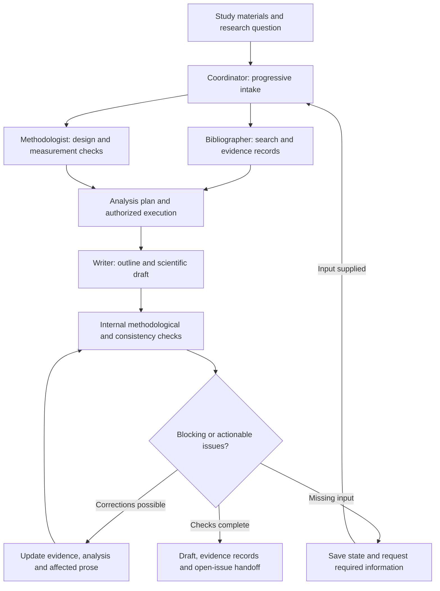
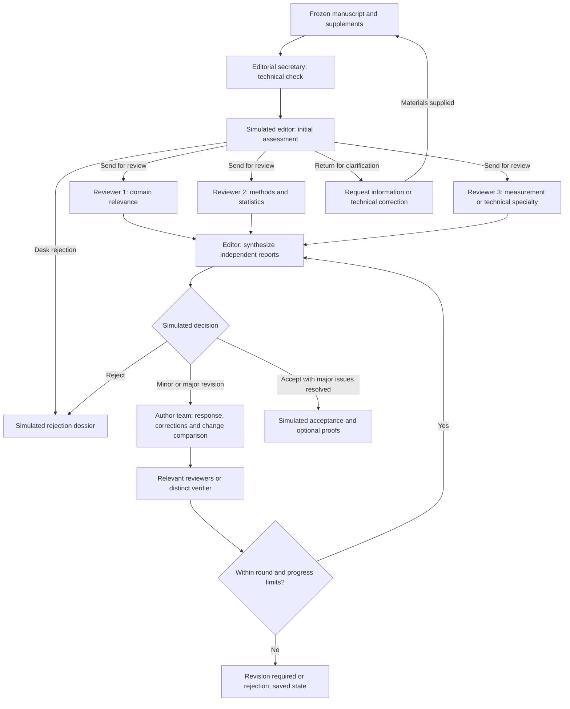
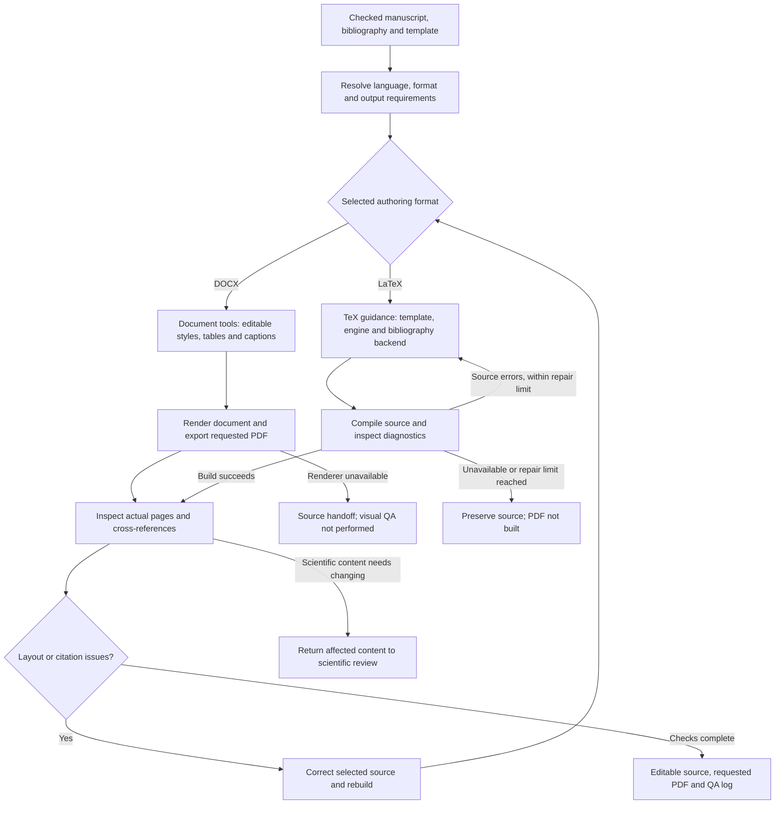
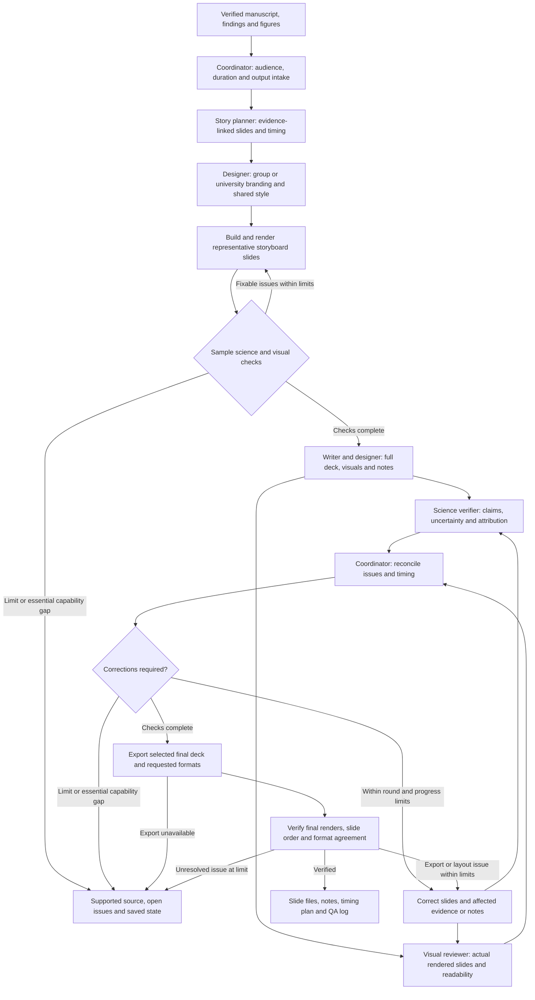
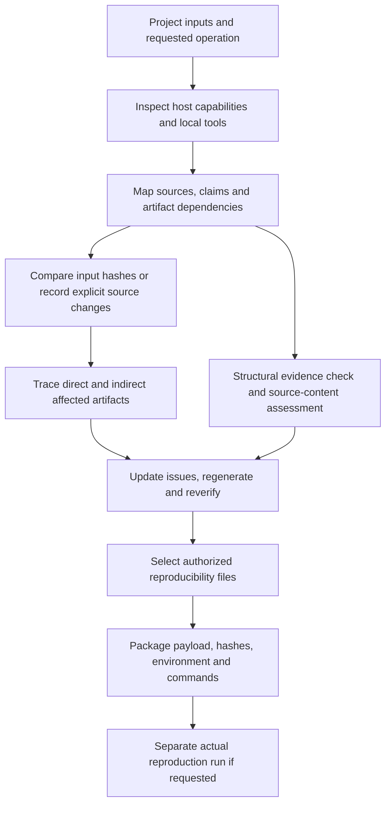
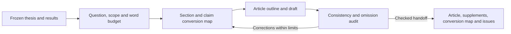
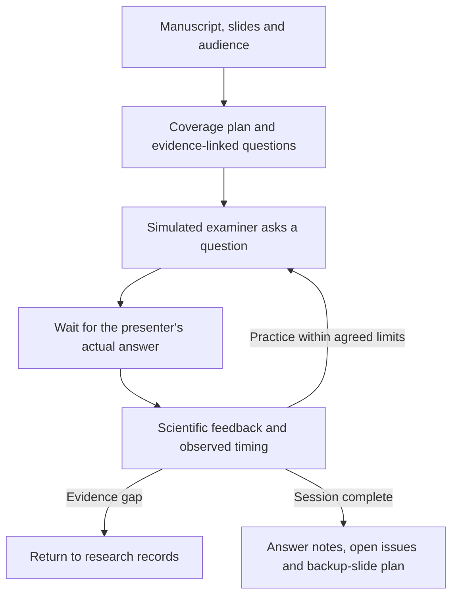
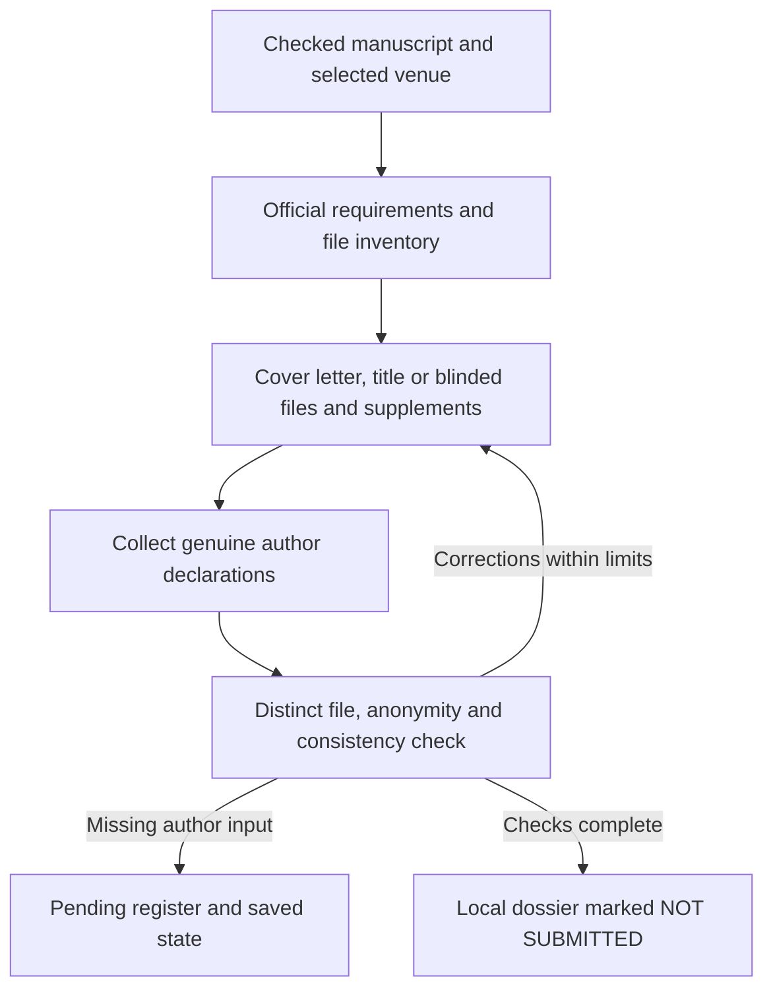
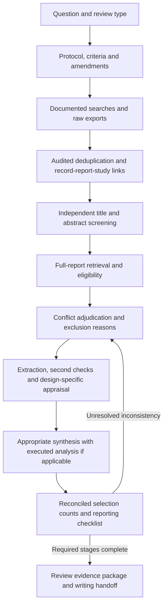

# Galileo — Advanced workflow guide

AI-assisted workflows for research papers, theses, dissertations and scientific talks. Galileo guides an assistant through progressive questions, specialist roles, traceable evidence and bounded revision loops. Instructions are in English; choose the language of your own documents.

**Start with the workflow that matches your current material.** You can draft from study information, review an existing manuscript, format an already checked text, or build slides from verified findings. You do not have to complete every workflow. For everyday use, start with the Galileo entry point described in the [quick start](../README.md). The nine specialist workflows below are available for direct use when desired.

| Your goal | Workflow | Typical deliverables |
|---|---|---|
| Develop a paper or thesis, with questions along the way | **Research drafting** | Study summary, evidence records, analysis outputs when executed, manuscript and unresolved issues |
| Test a manuscript through a realistic editorial simulation | **Research review** | Three simulated anonymous reviewer reports, editorial decision, response and revised manuscript |
| Produce a manuscript in Word or LaTeX | **Research typesetting** | Selected editable DOCX or TeX source, bibliography/assets and requested PDF when built |
| Prepare a conference talk, seminar or thesis defense | **Research presentations** | Storyboard, editable PPTX and PDF when generated, notes and timing plan |
| Check tools, trace evidence and changes, or package reproducibility files | **Research project** | Capability report, evidence map, impact report and selected-file bundle |
| Turn a thesis into a focused paper | **Thesis to article** | Article, conversion map, word budget and omission audit |
| Practice oral questions and answers | **Research defense** | Interactive rehearsal, feedback and backup-slide plan |
| Assemble journal-specific materials | **Submission dossier** | Cover letter, file/declaration checklist and local dossier |
| Plan and conduct systematic evidence synthesis | **Systematic review** | Protocol, screening/extraction/appraisal records and synthesis |

Galileo is an **instruction package, not an execution engine**. Independent agents, model routing, menus, analysis tools and document renderers depend on the host. A configured role is not proof that a separate agent or model ran. The review workflow is a simulation: it does not submit to a journal or produce real acceptance.

[Italian guide](README.it.md) · [Installation details](INSTALLATION.md) · [DOCX, LaTeX and slides](FORMATS_AND_SLIDES.md) · [Optional literature MCP](LITERATURE_INTEGRATIONS.md)

## Guide contents

- [Install](#1-install-in-your-research-project)
- [Invoke a workflow](#2-invoke-a-workflow)
- [Prepare your first request](#3-prepare-your-first-request)
- [A — Drafting](#workflow-a--draft-a-paper-or-thesis)
- [B — Editorial review](#workflow-b--simulate-editorial-review-and-revision)
- [C — DOCX or LaTeX](#workflow-c--format-in-docx-or-latex)
- [D — Scientific slides](#workflow-d--create-scientific-presentation-slides)
- [E — Project checks and reproducibility](#workflow-e--check-project-capabilities-evidence-and-changes)
- [F — Thesis to article](#workflow-f--convert-a-thesis-into-an-article)
- [G — Defense rehearsal](#workflow-g--rehearse-a-defense-or-scientific-qa)
- [H — Submission dossier](#workflow-h--prepare-a-submission-dossier)
- [I — Systematic review](#workflow-i--conduct-a-systematic-review)
- [Resume and hand off](#continue-change-scope-or-switch-workflow)
- [Quality and cost](#select-quality-and-cost-settings)
- [Literature MCP](#optional-literature-mcp-add-only-what-you-need)
- [Common problems](#common-problems)

## 1. Install in your research project

The offline installer requires Python 3.10+. Choose the research project in which your assistant should discover the skills, then replace the destination below with its real path:

```bash
git clone https://github.com/vage88sg1/agentic-research-workflows.git
cd agentic-research-workflows
python3 scripts/install.py --dest /path/to/your/research-project/.agents/skills --profile full --dry-run
python3 scripts/install.py --dest /path/to/your/research-project/.agents/skills --profile full
```

The dry run previews installation; the second command copies the skills. `full` installs Galileo, nine specialist workflows and nine upstream support skills (19 skill directories). It preserves licenses and provenance, refuses existing skill names and does not install libraries, compilers or MCP servers. It does not alter client settings or make network calls.

For a smaller installation, use the same profile in both commands:

| Profile | Workflow entry points | Additional guidance |
|---|---|---|
| `core` | Drafting, review | Seven scientific support skills |
| `docx` | Drafting, review, typesetting | Core scientific guidance; DOCX uses available host tools |
| `latex` | Drafting, review, typesetting | Core guidance plus academic-writing-latex |
| `slides` | Drafting, review, presentations | Core guidance plus scientific-slides |
| `publishing` | Drafting, review, typesetting, thesis-to-article, submission | Core guidance and project support |
| `defense` | Drafting, review, presentations, defense | Core guidance, scientific-slides and project support |
| `systematic` | Drafting, review, systematic review | Core guidance and project support |
| `full` | Galileo and all nine specialist workflows | All nine upstream support skills |

Galileo and Research project are included in every profile. The existing core/docx/latex/slides profiles keep their focused workflow selection and now include that support entry point.

Use a profile for a fresh destination. Installing another profile over the same skill names is not an update mechanism; back up and reconcile existing versions deliberately. For other scopes or clients, use their documented skill location. See [installation and host compatibility](INSTALLATION.md).

Open the research project in your assistant and refresh discovery or start a new session. Confirm that the installed workflow names appear. Installation alone does not establish that browsing, analysis, rendering or independent agents are operational.

## 2. Invoke a workflow

In a compatible Codex desktop client, type `/`, select the actual workflow entry in the skill menu, and add your task and file locations. In Codex CLI, use `/skills` to select a skill. The entries are:

- **Research drafting**
- **Research review**
- **Research typesetting**
- **Research presentations**
- **Research project**
- **Thesis to article**
- **Research defense**
- **Submission dossier**
- **Systematic review**

The prompt examples below use the explicit `$skill-name` syntax. Selecting the skill in the menu and then entering the task is an alternative. The installer does not register arbitrary aliases such as `/research-review`.

If your client does not support native skills, provide the relevant `skills/<workflow>/SKILL.md`, its references and applicable bundled guidance as instructions. Ask it to declare missing tools and whether it is using independent agents or sequential roles in one context.

## 3. Prepare your first request

Give the assistant the material you already have and identify its location. You can begin with an incomplete study description; the drafting workflow asks for missing information progressively.

Useful starting information includes:

- Research question, discipline and document type.
- Current stage: planning, data collected, analysis completed or manuscript drafted.
- Available protocol, data dictionary, instrument manuals, analysis code/results and references.
- Writing language, requested format and any institutional or journal requirements.
- Output directory, cost profile and authorized processing boundary.

For confidential research, establish what the selected host and services may receive before providing the material. Do not put private research files or credentials in this public repository. Public literature queries should contain topic terms rather than patient information or private manuscript passages.

The assistant records answers in project configuration and saves resumable state. The [example configuration](../examples/project-config.json) shows available settings; you do not need to fill every field before starting. These settings guide the assistant, rather than implementing automatic metering or enforcement.

## Workflow A — Draft a paper or thesis

Use **Research drafting** when you need to develop a manuscript from study information, sources and results. It also resumes an incomplete draft.

### Start

```text
$research-drafting Help me draft a research article from the materials in study_inputs/.
Write in English, use DOCX as the final manuscript format, and save work in research_workspace/.
Use the balanced cost profile. Ask up to three focused questions at a time.
Start with the research question, study design and available materials.
```

For a thesis, replace “research article” with the thesis type and provide the institution's requirements when available. For LaTeX, select LaTeX instead of DOCX; only the chosen route is applied.

### Workflow design



Roles are delegated when supported and authorized; otherwise they run sequentially with that limitation recorded. Internal drafting checks are distinct from the editorial simulation below.

### What happens

1. **Progressive intake:** the coordinator clarifies scope, design, measurements, available results and format. It reuses answers already recorded.
2. **Evidence and methods:** the bibliographer documents searches and source support; specialist roles check measurement rules, bias and the analysis plan.
3. **Analysis when authorized and possible:** the assistant executes code, records the environment and preserves outputs. If execution is unavailable, reproduction remains marked NOT PERFORMED.
4. **Outline and drafting:** the writer develops evidence-linked sections, then reconciles methods, results, tables, figures and citations.
5. **Internal correction:** methodological and consistency checks generate issues. Corrections update the underlying evidence/results before dependent prose.

Missing facts block dependent work, while useful independent work can continue. The workflow does not invent results, scoring rules, citations or declarations to complete a section.

### What to expect at handoff

A manuscript plus study/configuration records, bibliography, source/claim records, actual analysis code and outputs where available, an issue register and saved state. Exact filenames adapt to the project. Read the outstanding issues and distinguish checks actually performed from those still pending.

You can then invoke **Research review** on the saved manuscript. Editorial simulation is a separate step; drafting does not start it automatically. Selected-format production may use **Research typesetting** after the draft is checked.

[Drafting instructions](../skills/research-drafting/SKILL.md) · [Role contracts and cost profiles](../skills/research-drafting/references/agent-contracts.md)

## Workflow B — Simulate editorial review and revision

Use **Research review** on an existing manuscript, whether it was written with Galileo or elsewhere. Provide relevant supplements and specify a journal or use a generic editorial profile.

### Start

```text
$research-review Review research_workspace/manuscript/draft.md and the supplements in study_inputs/.
Use a generic research-journal profile, three independent simulated anonymous reviewers,
and a maximum of three review rounds. Write reports and author responses in English.
Save the review run in research_workspace/. State any limits on reviewer independence.
```

To match a particular journal, name it and ask the assistant to verify its current official requirements. For a thesis, specify institutional assessment criteria and any journal-style simulation you want; those are different processes.

### What happens

1. **Freeze the submitted version:** the coordinator records versions/hashes and available supplements.
2. **Technical and editorial assessment:** a secretary checks required materials; the simulated editor can request clarification, return for correction, desk-reject or send for review.
3. **Anonymous simulated peer review:** three complementary reviewers assess domain relevance, methods/statistics and measurement or another discipline-specific specialty. First-pass reports use fresh contexts when supported.
4. **Reasoned decision:** the editor weighs evidence and disagreements, producing simulated acceptance, minor revision, major revision or rejection.
5. **Author response and corrections:** the author team responds point by point, supplies a clean revision and change comparison, and reruns affected analysis or checks.
6. **Verification and rereview:** reviewers or a distinct verifier check corrections. Major changes return to the relevant reviewers.

### Workflow design



First-pass reviewers receive the same frozen evidence in separate contexts when available. They do not modify the master manuscript. The editor reasons from the reports rather than counting votes; correction verification is separate from author self-assessment. All decisions remain simulated.

The default limit is three complete rounds, stopping after two without substantive progress or at a blocking evidence gap. Reaching the limit never causes automatic acceptance. If separate contexts are unavailable, sequential role simulation is reported explicitly.

### What to expect at handoff

Reviewer reports, author-facing and editor-only comments, decision rationale, issue ledger, point-by-point response, revised manuscript/change comparison, check log and saved state. Editorial dossiers and simulated publication artifacts carry **SIMULATION — NOT SUBMITTED — NOT PUBLISHED**. No real DOI, journal acceptance, submission or publisher identity is created.

[Review instructions](../skills/research-review/SKILL.md)

## Workflow C — Format in DOCX or LaTeX

Use **Research typesetting** when the scientific text is ready for formatting. It can be invoked directly on an existing manuscript without running Galileo's other workflows.

### Start with Word

```text
$research-typesetting Format the checked manuscript in manuscript/ as an editable DOCX.
Use the supplied template in templates/, preserve all results and citations,
and export a PDF from the same final version. Inspect the rendered pages.
Save the deliverables in formatted_manuscript/.
```

### Start with LaTeX

```text
$research-typesetting Format the checked thesis in manuscript/ as LaTeX.
Use the supplied institutional template in templates/ and the verified bibliography.
Deliver editable TeX source, required assets and a compiled PDF in formatted_manuscript/.
Record the compiler/backend and inspect the final rendered pages.
```

### Workflow design



Only the selected authoring route runs. Each final artifact is checked against its actual source version; scientific corrections are handled by the scientific workflow.

### What happens and what you receive

The assistant resolves template, language, paper size, bibliography style and output requirements, then activates the selected route. DOCX uses editable document objects and available document tools. LaTeX uses academic-writing-latex guidance conditionally and a compatible compiler; a supported built-in editor/compiler is preferred when available.

Checks cover citations, cross-references, equations, tables/figures, pagination and actual rendered pages. Formatting preserves verified content; substantive changes return to scientific review.

You receive the selected editable source and requested PDF **only if actually generated**, plus assets and build/QA status. Without a renderer/compiler, source can be delivered with visual QA NOT PERFORMED or PDF NOT BUILT. A compiler pass does not establish scientific validity. Both authoring formats are produced only when requested.

[Typesetting instructions](../skills/research-typesetting/SKILL.md) · [Format requirements](FORMATS_AND_SLIDES.md)

## Workflow D — Create scientific presentation slides

Use **Research presentations** for a conference talk, seminar, journal club or thesis defense. Start from a manuscript, verified findings or an authorized source package; a completed editorial simulation is not required.

### Start

```text
$research-presentations Build a scientific conference talk from the checked manuscript
and figures in research_workspace/. The audience is researchers in this discipline.
Plan 12 minutes of speaking plus 3 minutes of Q&A, in English.
Deliver editable PPTX and PDF from the same final deck, with speaker notes and a timing plan.
Save work in presentation/. Use the research-group or university branding in brand_assets/
if supplied; ask about missing template or slide-count requirements.
```

For a thesis defense, specify the committee audience and required duration. If you want a PDF-only Beamer presentation, say so; Beamer does not automatically produce editable PowerPoint.

### Workflow design



Scientific and visual checks have separate responsibilities. PPTX and PDF come from the same final deck when both are selected; PDF-only Beamer uses its own build route. Final export changes are rechecked before handoff.

### What happens

1. **Presentation intake:** clarify audience, duration/Q&A, language, slide count, template, accessibility and outputs.
2. **Storyboard:** map each slide's purpose, message, evidence, visual, notes and time allocation.
3. **Design and samples:** reuse group/university branding and templates or propose visual directions, define a shared style and inspect two representative rendered slides before expanding the deck. Samples use real supplied evidence and remain within the requested slide count. Optional aesthetic choices do not impose an approval stop unless you request one.
4. **Production:** writer/designer roles apply the style to editable content and preserve uncertainty, units, denominators, limitations and source attribution.
5. **Scientific and visual review:** a science verifier checks claims; a visual reviewer inspects actual rendered slides and timing.
6. **Correction and export:** fix issues within the bounded loop, then check the final PPTX/PDF count, order and content agreement.

### What to expect at handoff

Requested slide files when generated, editable source/assets, references, speaker notes, timing plan, open issues and saved state. Missing conversion/rendering capabilities are reported; source or ZIP checks alone do not establish visual quality. Actual research talks about unpublished work are not automatically labeled simulated publication; illustrative data and simulated editorial outcomes are labeled where used.

[Presentation instructions](../skills/research-presentations/SKILL.md) · [Visual design and sample slides](../skills/research-presentations/references/visual-design.md) · [Export and visual QA](../skills/research-presentations/references/export-and-qa.md)

## Workflow E — Check project capabilities, evidence and changes

Use **Research project** before selecting a production route, when assessing claim support, after a source/result changes, or when preparing reproducibility materials. This support skill is included in every profile.

```text
$research-project Check the capabilities available for my project, then create an evidence
and dependency map from the supplied materials. Distinguish actual host capabilities from
unverified binaries, and identify claims needing source inspection. Save reports in project_checks/.
```

For a changed result, ask it to compare recorded hashes and trace affected claims, tables, figures, text and slides. It reports indirect dependencies and preserves prior records. For reproducibility, supply an explicit list of public/synthetic files, commands, environment and any restricted-input access conditions.



The Python tools perform concrete structural/file checks; a verifier still assesses whether consulted evidence supports a claim. Packaging does not execute analysis, classify private material automatically or prove reproduction. See [tool commands and the runnable synthetic example](PROJECT_TOOLS.md).

## Workflow F — Convert a thesis into an article

Use **Thesis to article** on an existing thesis. Select a focused question and target article type before compressing the text.

```text
$research-thesis-to-article Adapt thesis/ into a focused research article in English.
Use a generic journal profile until I provide a target. Propose the central question and
word budget, preserve relevant positive and negative findings, and document every
retained, condensed, corrected or omitted section. Save a separate run in article_conversion/.
```



The scope editor, evidence mapper, writer and consistency verifier preserve provenance while adapting structure and readership. New analyses need methodological review. You receive a draft, a conversion/omission map, word counts, supplement inventory and unresolved declarations. Real previous dissemination and authorship decisions remain author-supplied facts.

[Thesis-to-article instructions](../skills/research-thesis-to-article/SKILL.md)

## Workflow G — Rehearse a defense or scientific Q&A

Use **Research defense** with the manuscript, slides or source package you will present.

```text
$research-defense Help me rehearse my thesis defense using manuscript/ and presentation/.
Use coaching mode in Italian: ask one question, wait for my answer, then give feedback.
Cover scientific rationale, methods, interpretation and limitations. Prepare a backup-slide brief.
```



Choose coaching with feedback after each answer or mock examination with feedback after a block. Model-generated sample answers are labeled demonstrations; they are not observed presenter performance. Timing is labeled measured or estimated. Building backup slides is a separate invocation of Research presentations when requested.

[Defense instructions](../skills/research-defense/SKILL.md)

## Workflow H — Prepare a submission dossier

Use **Submission dossier** to assemble local materials for a selected journal, or an explicitly generic incomplete dossier.

```text
$research-submission Prepare a local submission dossier from the checked manuscript.
Verify the named journal's current official instructions, draft the cover letter,
map requirements to files, and identify declarations that need my actual answers.
Keep the package marked NOT SUBMITTED and preserve simulated-review labels where applicable.
```



Outputs include a cover-letter draft, appropriate identified/blinded files, supplements, requirements checklist and unresolved declaration register. Missing ethics, conflict, contribution or approval information is never silently filled with “none.” The workflow prepares materials; it does not upload, sign, contact editors or claim real acceptance.

[Submission instructions](../skills/research-submission/SKILL.md)

## Workflow I — Conduct a systematic review

Use **Systematic review** for a planned evidence synthesis, not simply the background section of a thesis. Adapt the question, methods and reporting framework to the discipline and review type.

```text
$research-systematic-review Help me plan a systematic review of my stated research question.
Start with protocol, eligibility criteria, source coverage and independent screening roles.
Record human versus AI participation, preserve search and screening decisions, and keep
unperformed stages incomplete. Decide whether quantitative synthesis is justified from the evidence.
```



Keep unavailable full texts separate from exclusions; records, reports and studies use distinct IDs. Two AI agents are not two human screeners. Meta-analysis is conditional on appropriate data and methods. PRISMA supports reporting; it does not certify methodological quality or complete coverage. Protocol registration, author contact and submission are not automatic actions.

You receive protocol/amendments, search logs/exports, deduplication and screening records, extraction/appraisal tables, synthesis/code when executed, reconciled flow counts and outstanding issues. Budget limits leave incomplete screening visibly incomplete.

[Systematic-review instructions](../skills/research-systematic-review/SKILL.md) · [Record conventions and official guidance](../skills/research-systematic-review/references/systematic-records.md)

## Continue, change scope or switch workflow

Resume with the same entry point and point to the saved run:

```text
$research-drafting Resume from research_workspace/workflow_state.json.
Reuse the recorded answers and completed checks. Identify the next unresolved task.
```

Use the corresponding entry point for a saved review, typesetting or presentation run and provide its actual state location. Do not assume the assistant remembers a previous session. Use the [starter state](../examples/workflow-state.json) and [issue-ledger columns](../examples/issues.csv) when creating a run; these are templates, not completed research records. State records should identify inputs/versions, phase, actual tools/models, review round, unresolved issues and the next action.

When changing language, format, venue or analysis scope, explain the change and ask the coordinator to identify affected outputs. Preserve originals and prior versions. Changes to scientific results require renewed checking of dependent text, tables, figures and slides.

A common route is **drafting → review → typesetting → presentation**, but each workflow remains independently usable. At every handoff, provide the current checked version, supporting records and outstanding issues rather than relying on chat history alone.

## Select quality and cost settings

Start with `balanced` for general drafting and substantive review. Use the `economy` profile when cost constraints are central, or `quality` for more intensive methodological and editorial assessment. Frontier models are an escalation tier for difficult, consequential unresolved problems. Ask the coordinator to apply the [role contracts and cost policy](../skills/research-drafting/references/agent-contracts.md), record actual model choices and keep reviewer contexts scoped.

Provider/model mappings are configurable. Model names in the guidance are examples, not required subscriptions or benchmark claims. A requested mapping is not an applied override unless the host supports and records it. Set budget and maximum active agents to match the host; the example limits concurrency to four including the coordinator. No paid service is activated by installation.

## Optional literature MCP: add only what you need

| Source connection | Main use |
|---|---|
| PubMed / Europe PMC | Biomedical discovery, MeSH, PMID metadata and available full text |
| OpenAlex | Complementary cross-disciplinary discovery and citation neighbors |
| Crossref | DOI and deposited bibliographic metadata/reference checks |
| Zotero | Reading an authorized reference library; experimental adapter |

These community adapters are configured separately from the skills. Codex examples start disabled. Other clients have individual opt-in fragments and need their own permission controls. Zotero startup settings require separate inspection because they can activate indexing/embeddings.

Start with an offline configuration check:

```bash
python3 scripts/check_literature_mcp.py
```

After choosing and inspecting an adapter, an explicit connection probe is available:

```bash
python3 scripts/check_literature_mcp.py --connect pubmed --timeout 60
```

`--connect` can download packages and execute the adapter. It initializes MCP and lists tools; it does not test an actual search or client access enforcement. Top-level versions/source revisions are pinned, but transitive dependencies are not locked. See the [setup and verification guide](LITERATURE_INTEGRATIONS.md) before activation. Live service access was not tested as part of this release.

## Common problems

| What you see | What to do |
|---|---|
| Workflow missing from the menu | Check the host-supported destination, refresh discovery and confirm the chosen profile includes the entry point |
| Installer reports an existing directory | Back up and reconcile versions or choose a fresh supported destination; installation does not overwrite |
| Assistant lacks an essential input | Provide its location or clarify the fact; leave dependent work pending rather than asking for invented content |
| Review reports are not independent | Use supported fresh agent contexts, or retain the explicit sequential-simulation limitation |
| DOCX/PPTX exists but PDF is missing | Check actual rendering/conversion availability; preserve source and the unperformed QA status |
| LaTeX does not compile | Check the template's engine/backend and diagnostics; compilation status must remain unverified until it succeeds |
| MCP initializes but searches fail | Inspect current tool schemas, runtime/credentials/rate limits and record the failure; tool discovery is not API validation |

## Included support skills and project validation

Nine upstream skills support the nine entry points: `scientific-writing`, `citation-management`, `scientific-critical-thinking`, `statistical-analysis`, `literature-review`, `scientific-visualization`, `peer-review`, `scientific-slides` and `academic-writing-latex`.

Eight come from K-Dense; academic-writing-latex comes from HS0n4. They are third-party skills, not OpenAI-maintained instructions. Sources, licenses, revisions and file hashes are recorded in [THIRD_PARTY_NOTICES.md](../THIRD_PARTY_NOTICES.md) and `vendor/provenance.json`. Read applicable instructions before use; installation does not activate their external services or optional dependencies.

For contributors, run the package checks with Python 3.11+:

```bash
python3 -m unittest discover -s tests -v
python3 scripts/validate_package.py
python3 scripts/check_literature_mcp.py
```

These checks cover packaging, links, provenance, installer behavior and MCP configuration/protocol fixtures. They do not certify scientific correctness or end-to-end host execution. The [synthetic evaluation protocol](../examples/SYNTHETIC_EVALUATION.md) describes behavioral checks that have not been run as full multi-agent research trials.

[Final review and remaining validation](RELEASE_REVIEW.md#final-package-review-2026-09-27) · [Contributing](../CONTRIBUTING.md) · [Security](../SECURITY.md) · [Evidence integrity](../skills/research-drafting/references/skill-integration.md)

Original workflow code and documentation: [MIT](../LICENSE). Bundled third-party content retains its own MIT notices; referenced MCP adapters have separate licenses. No affiliation with journals, universities, OpenAI, Zotero or the source providers is implied.
